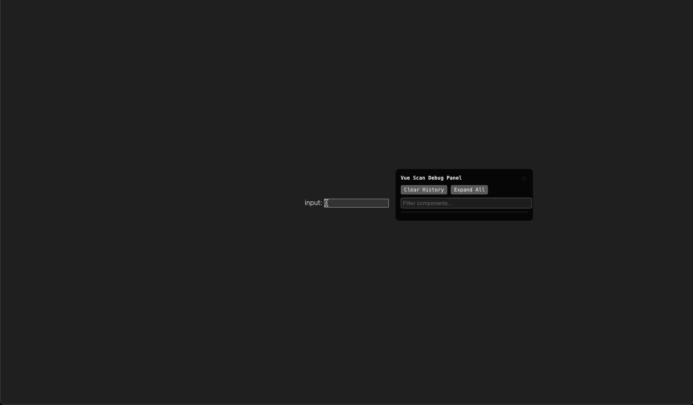

# vue-plugin-scan

like [react-scan](https://github.com/aidenybai/react-scan)

> Scan your Vue app for renders



## Features

- 🔍 **Component Render Tracking** - Highlight components when they re-render
- 📊 **FPS Monitoring** - Real-time FPS display with history chart
- 💾 **Memory Monitoring** - Track JS heap memory usage
- 📈 **Web Vitals** - Monitor FCP, LCP, FID, and CLS metrics
- 🎯 **Performance Panel** - Visual debugging panel with component details
- 🖱️ **Interactive** - Click to highlight and inspect components

## Install

```bash
npm install vue-plugin-scan
```

## Usage

```ts
import { createApp } from 'vue'
import VueScan, { type VueScanOptions } from 'vue-plugin-scan'
import App from './App.vue'

import './style.css'

const app = createApp(App)
app.use<VueScanOptions>(VueScan, {})
app.mount('#app')
```

## Options

```ts
interface VueScanOptions {
  /** Enable vue-scan (default: true in development) */
  enable?: boolean
  /** Hide component name labels (default: false) */
  hideComponentName?: boolean
  /** Highlight duration in ms (default: 1000) */
  interval?: number
  /** Enable debug panel (default: true) */
  enablePanel?: boolean
  /** Enable FPS monitoring (default: true) */
  enableFPS?: boolean
  /** Enable performance monitoring (default: true) */
  enablePerformance?: boolean
  /** FPS warning threshold (default: 30) */
  fpsWarningThreshold?: number
  /** Performance update interval in ms (default: 1000) */
  performanceUpdateInterval?: number
}
```

## Example with all options

```ts
import { createApp } from 'vue'
import VueScan from 'vue-plugin-scan'
import App from './App.vue'

const app = createApp(App)

app.use(VueScan, {
  enable: true,
  enablePanel: true,
  enableFPS: true,
  enablePerformance: true,
  fpsWarningThreshold: 30,
  performanceUpdateInterval: 1000,
  hideComponentName: false,
  interval: 1000,
})

app.mount('#app')
```

## What it monitors

### FPS (Frames Per Second)
- Current FPS value
- Average, min, and max FPS
- Real-time FPS chart
- Warning when FPS drops below threshold

### Memory
- Used JS heap size
- Memory usage percentage
- Visual progress bar

### Web Vitals
- **FCP** (First Contentful Paint)
- **LCP** (Largest Contentful Paint)
- **FID** (First Input Delay)
- **CLS** (Cumulative Layout Shift)

### Component Tracking
- Render count per component
- Render time measurements
- Props change history
- Average render time

## Credits

- [react-scan](https://github.com/aidenybai/react-scan)
